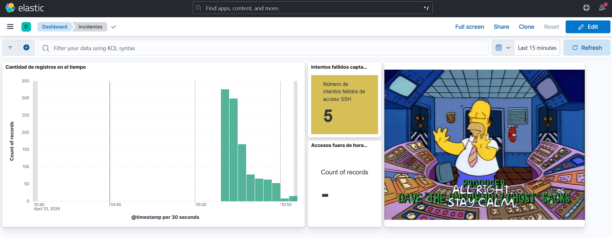
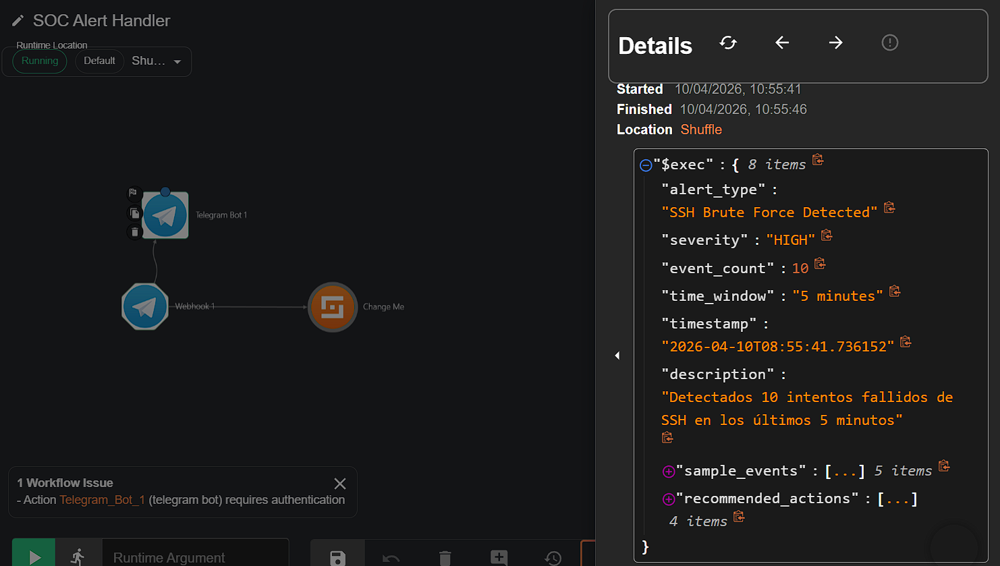

# CyberSOC Básico - Proyecto UD4

## 📋 Descripción

Implementación de un **Security Operations Center (SOC)** básico para una organización ficticia de tamaño medio (50-100 empleados). El sistema permite monitorizar actividad de red, detectar amenazas en tiempo real, generar alertas automáticas y gestionar incidentes de seguridad.

Este proyecto demuestra capacidades completas de:
- ✅ Monitorización de sistemas
- ✅ Detección de eventos relevantes
- ✅ Generación de alertas automáticas
- ✅ Clasificación y documentación de incidentes
- ✅ Seguimiento de casos de seguridad

---

## 🏗️ Arquitectura del Sistema

### Stack Tecnológico

| Componente | Herramienta | Función |
|------------|-------------|---------|
| **SIEM** | Elasticsearch + Kibana | Almacenamiento, búsqueda y visualización de logs |
| **Recolección** | Filebeat | Captura y envío de logs desde contenedores |
| **SOAR** | Shuffle | Automatización y gestión de respuesta a incidentes |
| **Integración** | Python Monitor | Script de correlación y detección avanzada |
| **Generación de Tráfico** | Kali Linux | Simulación de ataques para pruebas |
| **Víctima** | OpenSSH Server | Servidor SSH vulnerable para demostraciones |

### Diagrama de Flujo

```
┌─────────────┐      ┌──────────────┐      ┌────────────────┐
│ Kali Linux  │────▶│ Victim SSH   │─────▶│   Filebeat     │
│  (Atacante) │      │  (Objetivo)  │      │ (Recolector)   │
└─────────────┘      └──────────────┘      └────────┬───────┘
                                                    │
                                                    ▼
┌─────────────┐      ┌──────────────┐      ┌────────────────┐
│   Shuffle   │◀────│Python Monitor│◀─────│ Elasticsearch  │
│    (SOAR)   │      │ (Detección)  │      │     (SIEM)     │
└─────────────┘      └──────────────┘      └────────┬───────┘
                                                    │
                                                    ▼
                                            ┌────────────────┐
                                            │     Kibana     │
                                            │ (Visualización)│
                                            └────────────────┘
```

---

## 🚀 Instalación y Configuración

### Requisitos Previos

- **Docker Desktop** (versión 20.10 o superior)
- **Docker Compose** (versión 2.0 o superior)
- **Sistema Operativo**: Windows 10/11, macOS, o Linux
- **Recursos mínimos**:
  - RAM: 8 GB (recomendado 16 GB)
  - Disco: 20 GB libres
  - CPU: 4 cores

### Instalación Paso a Paso

**1. Clonar el repositorio:**

```bash
git clone https://github.com/TU_USUARIO/cybersoc-proyecto.git
cd cybersoc-proyecto
```

**2. Verificar la estructura del proyecto:**

```
cybersoc-proyecto/
├── docker-compose.yml
├── filebeat/
│   └── filebeat.yml
├── monitor/
│   ├── monitor.py
│   ├── requirements.txt
│   └── Dockerfile
└── README.md
```

**3. Levantar todos los servicios:**

```bash
docker-compose up -d
```

**4. Verificar que todos los contenedores están corriendo:**

```bash
docker-compose ps
```

Deberías ver 9 contenedores en estado "Up":
- elasticsearch
- kibana
- filebeat
- shuffle-backend
- shuffle-frontend
- shuffle-orborus
- alert-monitor
- victim-ssh
- kali-attacker

**5. Esperar a que los servicios se inicialicen (3-5 minutos)**

---

## 🌐 Acceso a las Interfaces

Una vez levantado el entorno, puedes acceder a:

| Servicio | URL | Credenciales |
|----------|-----|--------------|
| **Kibana** | http://localhost:5601 | Sin autenticación |
| **Shuffle** | http://localhost:3001 | admin / (tu contraseña) |
| **Elasticsearch** | http://localhost:9200 | Sin autenticación |

---

## 🎯 Configuración Inicial

### 1. Configurar Kibana

**Crear Data View:**

1. Accede a Kibana → **Management** → **Stack Management**
2. Ve a **Kibana** → **Data Views**
3. Click en **"Create data view"**
4. Configura:
   - Name: `Filebeat Logs`
   - Index pattern: `filebeat-*`
   - Timestamp field: `@timestamp`
5. Guarda

**Crear Regla de Detección:**

1. Ve a **Stack Management** → **Rules**
2. Click **"Create rule"** → **"Elasticsearch query"**
3. Configura según las reglas documentadas (ver sección Reglas de Detección)

### 2. Configurar Shuffle

**Primera vez:**

1. Accede a http://localhost:3001
2. Crea tu cuenta de administrador
3. Inicia sesión
4. El workflow "SOC Alert Handler" ya debería estar creado y recibiendo alertas

---

## 🔍 Reglas de Detección Implementadas

### 1. SSH Brute Force Attack

**Descripción:** Detecta múltiples intentos fallidos de autenticación SSH en un periodo corto de tiempo.

**Criterios:**
- Más de 5 intentos fallidos en 5 minutos
- Patrones detectados: "Failed password", "authentication failure", "Invalid user"

**Severidad:** HIGH

**Acciones recomendadas:**
- Revisar logs en Kibana
- Identificar IP de origen
- Considerar bloqueo temporal
- Evaluar falsos positivos


### 2. Login SSH Exitoso Fuera de Horario Laboral

**Descripción:** Detecta accesos SSH **exitosos** realizados fuera del horario laboral establecido, lo que podría indicar acceso no autorizado o actividad sospechosa.

**Criterios:**
- Login SSH exitoso (Accepted password) antes de 09:00 o después de 14:30
- Solo detecta autenticaciones exitosas, NO intentos fallidos
- Ventana de detección: 5 minutos

**Severidad:** MEDIUM

**Acciones recomendadas:**
- Verificar si es actividad autorizada (mantenimiento programado, administrador)
- Identificar usuario que realizó el acceso y justificación
- Revisar qué comandos se ejecutaron durante la sesión
- Contactar al usuario para confirmar que fue él
- Si no está autorizado, investigar como posible compromiso de cuenta

---

## 🧪 Simulación de Ataques

### Ataque 1: Fuerza Bruta SSH

```bash
# Acceder a Kali
docker exec -it kali-attacker bash

# Instalar herramientas
apt-get update && apt-get install -y sshpass

# Ejecutar ataque
for i in {1..10}; do
  sshpass -p "wrongpassword$i" ssh -o StrictHostKeyChecking=no -o UserKnownHostsFile=/dev/null testuser@victim-ssh -p 2222 2>&1
  echo "Intento $i completado"
  sleep 2
done
```

**Resultado esperado:**
- Logs visibles en Kibana Discover
- Alerta generada en Kibana Rules
- Notificación enviada a Shuffle
- Caso registrado en Shuffle con severidad HIGH

### Ataque 2: Login Exitoso Fuera de Horario

**Nota:** Este ataque solo generará alertas si se ejecuta **fuera del horario laboral** (antes de 09:00 o después de 14:30).

```bash
# Acceder a Kali
docker exec -it kali-attacker bash

# Ejecutar LOGIN EXITOSO fuera de horario 09:00-14:30
sshpass -p "Password123" ssh -o StrictHostKeyChecking=no -o UserKnownHostsFile=/dev/null testuser@victim-ssh -p 2222 "whoami && hostname && exit"

# O para generar múltiples logins exitosos
for i in {1..3}; do
  sshpass -p "Password123" ssh -o StrictHostKeyChecking=no testuser@victim-ssh -p 2222 "echo 'Acceso $i' && exit"
  sleep 2
done
```

**Resultado esperado:**
- Alerta de severidad MEDIUM en Shuffle
- Descripción: "Login SSH exitoso fuera del horario laboral"
- Recomendación de verificar si es actividad autorizada
- **Diferencia clave:** Solo detecta logins exitosos, NO intentos fallidos (esos los detecta la regla de Brute Force)

---

## 📊 Monitorización y Logs

### Ver logs del monitor Python:

```bash
docker-compose logs -f alert-monitor
```

### Ver logs de un servicio específico:

```bash
docker-compose logs -f elasticsearch
docker-compose logs -f kibana
docker-compose logs -f filebeat
```

### Ver todos los logs:

```bash
docker-compose logs
```

---

## 🛠️ Mantenimiento

### Detener el entorno:

```bash
docker-compose down
```

### Detener y eliminar volúmenes:

```bash
docker-compose down -v
```

### Reiniciar un servicio específico:

```bash
docker-compose restart alert-monitor
```

### Reconstruir después de cambios en código:

```bash
docker-compose down
docker-compose up -d --build
```

---


## 🔒 Consideraciones de Seguridad

⚠️ Este proyecto es **solo para fines educativos** en entornos controlados.

**Configuraciones inseguras implementadas para facilitar la demostración:**
- Elasticsearch sin autenticación
- Kibana sin autenticación
- Contraseñas SSH débiles conocidas
- Sin cifrado TLS/SSL

**Para producción se debe:**
- ✅ Habilitar autenticación en Elasticsearch/Kibana
- ✅ Usar contraseñas fuertes y únicas
- ✅ Implementar TLS/SSL en todas las comunicaciones
- ✅ Configurar firewalls y segmentación de red
- ✅ Implementar 2FA donde sea posible

---

## 🐛 Solución de Problemas

### Problema: Contenedor reiniciándose constantemente

```bash
# Ver logs del contenedor problemático
docker-compose logs <nombre-contenedor>

# Reiniciar el contenedor
docker-compose restart <nombre-contenedor>
```

### Problema: No aparecen logs en Kibana

1. Verificar que Filebeat está corriendo: `docker-compose ps filebeat`
2. Verificar logs de Filebeat: `docker-compose logs filebeat`
3. Verificar que existe el data view en Kibana
4. Verificar conectividad con Elasticsearch: `curl http://localhost:9200`

### Problema: Alertas no llegan a Shuffle

1. Verificar logs del monitor: `docker-compose logs alert-monitor`
2. Verificar que el webhook está en estado "Running" en Shuffle
3. Verificar URL del webhook en `monitor/monitor.py`

---

## 📚 Recursos Adicionales

- [Documentación de Elasticsearch](https://www.elastic.co/guide/en/elasticsearch/reference/current/index.html)
- [Documentación de Kibana](https://www.elastic.co/guide/en/kibana/current/index.html)
- [Documentación de Filebeat](https://www.elastic.co/guide/en/beats/filebeat/current/index.html)
- [Documentación de Shuffle](https://shuffler.io/docs)
- [MITRE ATT&CK Framework](https://attack.mitre.org/)

---


## 📝 Licencia

Este proyecto es de código abierto con fines educativos.


---

## 👥 Equipo del Proyecto

- **Integrantes del equipo**: Fran González y Julián Valzacchi
- **Fecha**: Febrero 2026
- **Asignatura**: Incidentes de Ciberseguridad - UD4

---





**Última actualización:** 08/02/2026